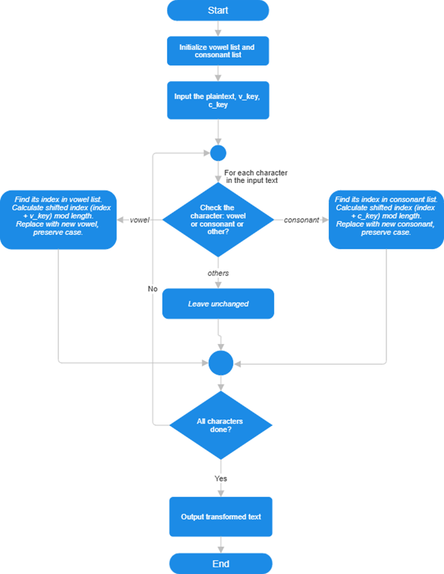
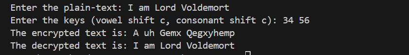

<p align="center">
  
</p>

<h2 align="center"><strong>Hajee Mohammad Danesh Science and Technology University</strong></h2>

<h3 align="center">Dinajpur-5200</h3>

---

<h2 align="center" style="color:#16a085;"><strong>📚 Course Information</strong></h2>

<p align="center">
  <strong>Course Title:</strong> Mathematical Analysis for Computer Science  
  <br>
  <strong>Course Code:</strong> CSE 361
</p>

---

<h2 align="center" style="color:#2980b9;"><strong>🔐 Algorithm Name</strong></h2>

<h1 align="center" style="color:#8e44ad;"><strong>Yonic Shift Cipher</strong></h1>

---

<h2 align="center" style="color:#16a085;"><strong>🧑‍💻 Submitted By</strong></h2>

<p align="center">
  <strong>Name:</strong> Ashikur Rahman  
  <br>
  <strong>Student ID:</strong> 2102028  
  <br>
  <strong>Level:</strong> 3  
  <br>
  <strong>Semester:</strong> II  
  <br>
  <strong>Department:</strong> Computer Science and Engineering  
</p>

---

<h2 align="center" style="color:#16a085;"><strong>👨‍🏫 Submitted To</strong></h2>

<p align="center">
  <strong>Name:</strong> Pankaj Bhowmik  
  <br>
  <strong>Designation:</strong> Lecturer  
  <br>
  <strong>Department:</strong> Computer Science and Engineering  
</p>

---

# 📝 Assignment Report

---

## 1️⃣ Introduction

The **Yonic Shift Cipher** is a modified substitution cipher designed to manipulate vowels and consonants separately within a text. Unlike traditional shift ciphers, this approach keeps vowels within the vowel set and consonants within the consonant set, shifting their positions internally by specified keys. This method preserves the letter's case and skips over the other set, providing an interesting variation on classical encryption techniques. The cipher can be used to demonstrate basic cryptographic concepts in an educational context.

---

## 2️⃣ Algorithm and Pseudocode

### 2.1 Conceptual Overview

- The alphabet is divided into two ordered lists:
  - **Vowels:** [A, E, I, O, U, Y]
  - **Consonants:** All other alphabet letters, excluding vowels.
- **During encryption:**
  - Vowels are shifted within the vowel list by `v_key`.
  - Consonants are shifted within the consonant list by `c_key`.
- All shifts wrap around circularly.
- Case is preserved.
- Non-alphabet characters remain unchanged.
- Decryption shifts backward using the same keys.

---

### 2.2 Pseudocode

```plaintext
Vowels = ['A', 'E', 'I', 'O', 'U', 'Y']
Consonants = ['B', 'C', 'D', 'F', 'G', 'H', 'J', 'K', 'L', 'M', 
              'N', 'P', 'Q', 'R', 'S', 'T', 'V', 'W', 'X', 'Z']

function encrypt(text, v_key, c_key):
    output = ""
    for each character ch in text:
        if ch is a letter:
            uppercase_ch = ch.upper()
            if uppercase_ch in Vowels:
                index = position of uppercase_ch in Vowels
                new_index = (index + v_key) mod length(Vowels)
                new_char = Vowels[new_index]
            else:
                index = position of uppercase_ch in Consonants
                new_index = (index + c_key) mod length(Consonants)
                new_char = Consonants[new_index]
            if ch is lowercase:
                new_char = new_char.lower()
            output += new_char
        else:
            output += ch
    return output

function decrypt(text, v_key, c_key):
    output = ""
    for each character ch in text:
        if ch is a letter:
            uppercase_ch = ch.upper()
            if uppercase_ch in Vowels:
                index = position of uppercase_ch in Vowels
                new_index = (index - v_key) mod length(Vowels)
                new_char = Vowels[new_index]
            else:
                index = position of uppercase_ch in Consonants
                new_index = (index - c_key) mod length(Consonants)
                new_char = Consonants[new_index]
            if ch is lowercase:
                new_char = new_char.lower()
            output += new_char
        else:
            output += ch
    return output
````

---

## 3️⃣ Flowchart of the Algorithm

<p align="center">
  
</p>

---

## 4️⃣ Experimental Example

**Input:**
Plaintext: `"Ashik"`
Vowel Key: `2`
Consonant Key: `3`

**Processing:**

* Vowels in `"Ashik"`: `A`, `i`
* Consonants in `"Ashik"`: `s`, `h`, `k`

**Encryption:**

| Character | Type      | Index |  New Index  | Encrypted Char |
| --------- | --------- | ----- | ----------- | -------------- |
| A         | Vowel     | 0     |  (0+2)%6=2  | I              |
| s         | Consonant | 14    |(14+3)%20=17 | w              |
| h         | Consonant | 5     |  (5+3)%20=8 | l              |
| i         | Vowel     | 2     |  (2+2)%6=4  | u              |
| k         | Consonant | 7     | (7+3)%20=10 | n              |

**Result:** `"Iwlun"`

---

## 5️⃣ Source Code Implementation

### 🚀 Implementation in C++

```cpp
#include <bits/stdc++.h>
using namespace std;

const string vowels = "aeiouy";
const string consonants = "bcdfghjklmnpqrstvwxz";

map<char, int> v_map, c_map;

void initialize() {
    for (int i = 0; i < (int)vowels.size(); i++) {
        v_map[vowels[i]] = i;
        v_map[toupper(vowels[i])] = i; // handle uppercase vowels
    }
    for (int i = 0; i < (int)consonants.size(); i++) {
        c_map[consonants[i]] = i;
        c_map[toupper(consonants[i])] = i; // handle uppercase consonants
    }
}

int checkChar(char c) {
    if (v_map.find(c) != v_map.end()) return 0;
    if (c_map.find(c) != c_map.end()) return 1;
    return -1; // neither vowel nor consonant
}

string encrypt(string s, int v_key, int c_key){
    string temp;
    for(char c : s){
        if(checkChar(c)==-1) {
            temp.push_back(c);
        } else {
            bool upper = isupper(c);
            c = tolower(c);

            if(checkChar(c)==0){
                int pos = v_map[c];
                pos = (pos + v_key) % 6;
                c = vowels[pos];
            } else {
                int pos = c_map[c];
                pos = (pos + c_key) % 20;
                c = consonants[pos];
            }
            if(upper) c = toupper(c);
            temp.push_back(c);
        }
    }
    return temp;
}

string decrypt(string s, int v_key, int c_key){
    string temp;
    for(char c : s){
        if(checkChar(c)==-1) {
            temp.push_back(c);
        } else {
            bool upper = isupper(c);
            c = tolower(c);

            if(checkChar(c)==0){
                int pos = v_map[c];
                pos = ((pos - v_key) % 6 + 6) % 6;
                c = vowels[pos];
            } else {
                int pos = c_map[c];
                pos = ((pos - c_key) % 20 + 20) % 20;
                c = consonants[pos];
            }
            if(upper) c = toupper(c);
            temp.push_back(c);
        }
    }
    return temp;
}

int main() {
    initialize();

    cout << "Enter the plain-text: ";
    string s; getline(cin, s);
    cout << "Enter the keys (vowel shift, consonant shift): ";
    int v_key, c_key; cin >> v_key >> c_key;

    string enc = encrypt(s, v_key, c_key);
    cout << "The encrypted text is: " << enc << endl;

    string dec = decrypt(enc, v_key, c_key);
    cout << "The decrypted text is: " << dec << endl;

    return 0;
}
```
### Sample Input-Output:
  
</p>

---

## 6️⃣ Conclusion

The **Yonic Shift Cipher** provides an engaging variation of classical substitution ciphers by shifting vowels and consonants within their respective sets based on simple keys. This method maintains the natural structure of the message while adding encryption complexity through internal shifting, making it suitable for understanding fundamental cryptographic concepts.

